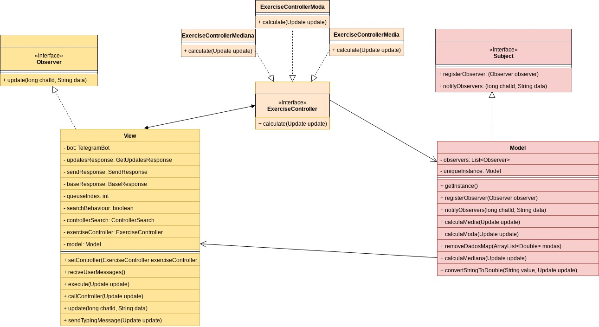
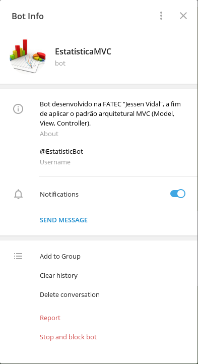
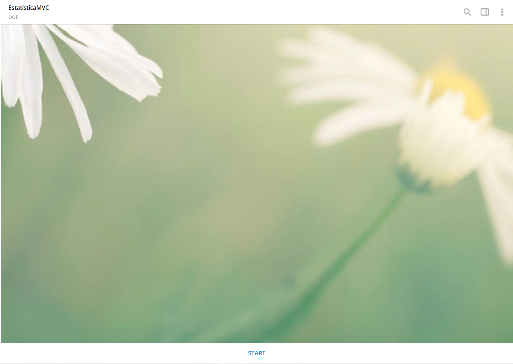
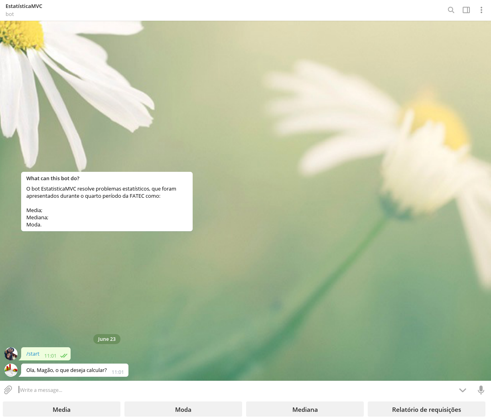
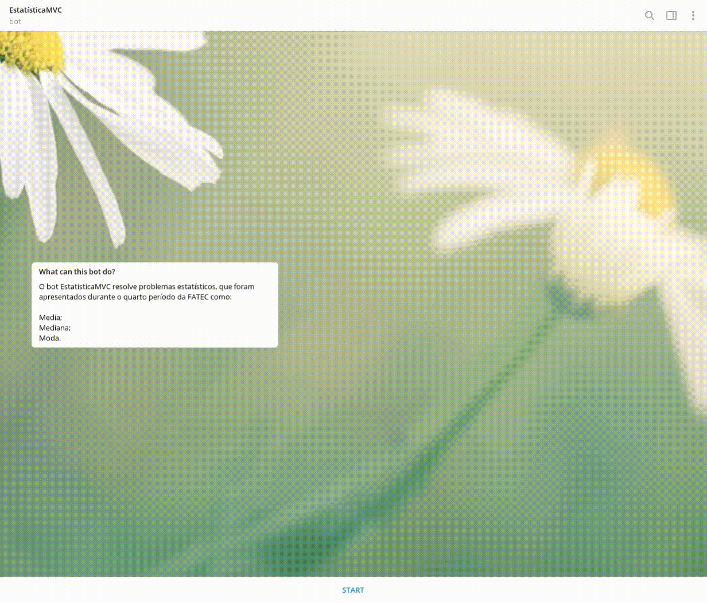
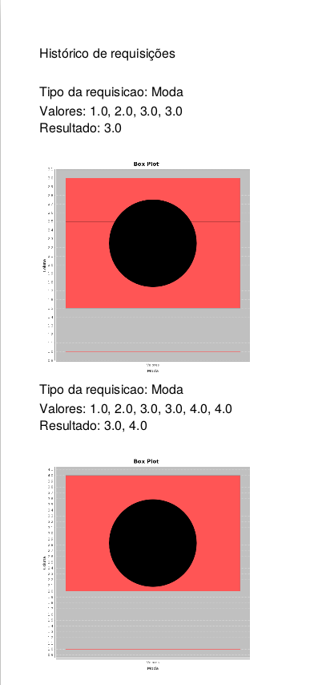
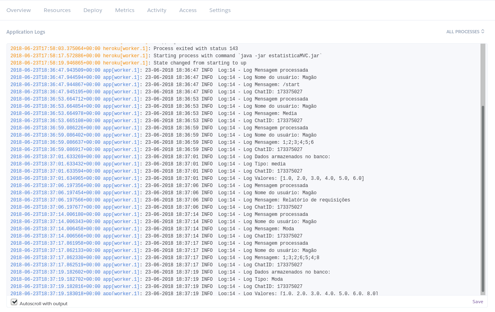

# EstatisticaMVC

[](https://www.codacy.com/app/magaum/EstatisticaMVC?utm_source=github.com&amp;utm_medium=referral&amp;utm_content=magaum/EstatisticaMVC&amp;utm_campaign=Badge_Grade)
[](https://travis-ci.org/magaum/EstatisticaMVC)
[](https://coveralls.io/github/magaum/EstatisticaMVC?branch=master)

Projeto para a materia de Estatística Aplicada e Engenharia de Software III, criado com o padrão de arquitetura MVC.

Para que o projeto funcione o arquivo example.properties deve ser renomeado para token.properties e o token gerado no [botfather](https://core.telegram.org/bots) deve ser adicionado no arquivo para que a integração com o telegram ocorra.

**Links para consulta:**

* [Pengrad](https://github.com/pengrad/java-telegram-bot-api/blob/master/README.md)
* [DB4O](https://sourceforge.net/projects/db4o/)
* [JfreeChart](http://www.jfree.org/jfreechart/)
* [ITextPDF](http://itextsupport.com/apidocs/itext7/latest/)
* [Log4j](https://logging.apache.org/log4j/2.x/)
* [Heroku](https://devcenter.heroku.com/articles/container-registry-and-runtime)

## Diagrama de classes



## Funcionamento do sistema

---

### **Informações sobre o Bot**



---

### **Primeiro comando**



---

### **Resposta do Bot**



---

### **Calculando Media**



---

### **Calculando Moda**


---

### **Calculando Mediana**


---

### **Recuperando informações salvas**


O arquivo historico.pdf tem o formato como no exemplo abaixo:



---

### **Tratativa para comandos inválidos**

As tratativas demonstradas abaixo são respectivamente:

1. Mensagens inválidas para realizar operações: as mensagens aceitas são somente Media, Moda ou Mediana;
2. Mensagens inválidas em operações: mensagens aceitas são apenas números separados entre ponto e vírgula (exemplo 1;2;3;4);
3. Consulta de relatório de requisições vazio (o usuário ainda não requisitou nenhuma operação ao bot, portanto não existe histórico salvo no banco de dados);
4. Mensagens inválidas em operações (item 2).


---

## **Deploy no heroku**

Foi gerado o [Dockerfile](https://docs.docker.com/engine/reference/builder/) abaixo:

```
FROM openjdk:8
ADD ./estatistica /home/
WORKDIR /home/
RUN adduser --disabled-password user 
USER user
CMD ["java","-jar","estatisticaMVC.jar"]
```

O diretório **estatistica**, localizado no mesmo diretório do arquivo Dockerfile citado acima contém a seguinte estrutura:

* estatistica/files/imgs/boxPlots/ 
    - Diretório onde os box plots são gerados
* estatistica/files/pdf/ 
    - Diretório onde os PDFs são gerados
* estatistica/db/bancoProblemas.db4o 
    - Arquivo do banco de dados **db4o**
* estatistica/src/main/resources/token.properties 
    - Arquivo de propriedades do [Telegram](https://telegram.org/)
* estatistica/log4j.properties 
    - Arquivo de propriedades do Log4j
* estatistica/estatisticaMVC.jar 
    - Arquivo jar executável do projeto.

Para fazer o deploy da aplicação no heroku é necessário executar os comandos:

```
heroku container:login
heroku container:push [tipo de aplicação] --[nome da aplicação]
heroku container:release [tipo da aplicação] --[nome da aplicação]
```
* Tipo de apliação: **web** ou **worker**.
* Nome da aplicação: pode ser visualizado no heroku, ou ao executar o comando **heroku create**.

Com o log4j, é possível acompanhar as requisições feitas ao bot, clicando em "More > View logs" no site [heroku](https://www.heroku.com/).



### Dependência quebrada

A dependência db4o está disponível no site [MVN Repository](https://mvnrepository.com/artifact/com.db4o/db4o-core-java5), porém está quebrada, por isto foi necessário baixa-la manualmente e adiciona-la ao projeto.
