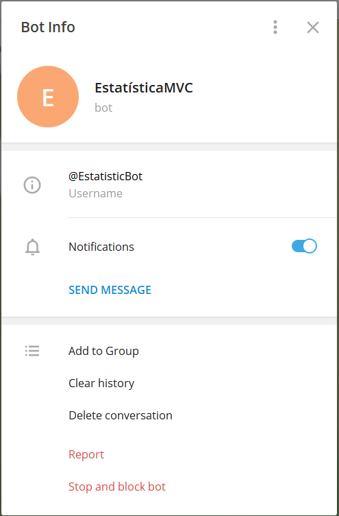
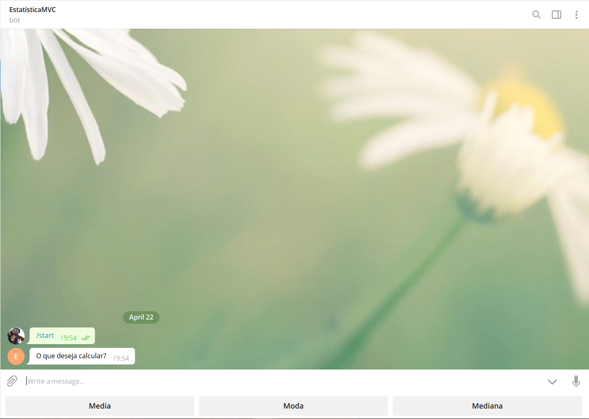
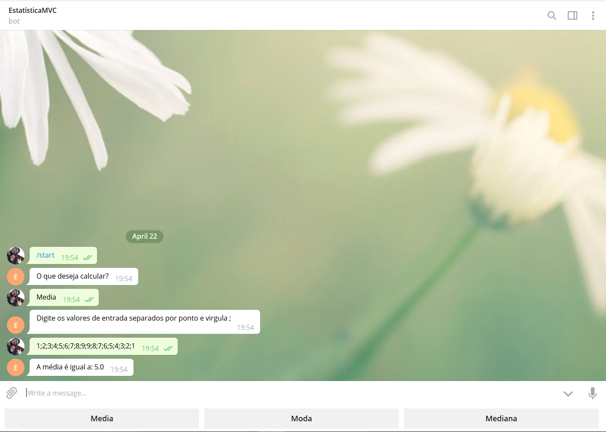

# EstatisticaMVC
Projeto para o material de estatística aplicado, feito com metologia MVC

Para que o projeto funcione o arquivo example.properties deve ser renomeado para token.properties e o token gerado no bot father deve ser adicionado no arquivo para que a integração com o telegram ocorra

**Links para consulta:**

* API [Pengrad;](https://github.com/pengrad/java-telegram-bot-api/blob/master/README.md)

# Funcionamento do sistema

---

### **Informações Bot**

---

### **Primeiro comando**

---

### **Resposta do Bot**

---

### **Calculando Media**

---

### **Calculando Moda**

---

### **Calculando Mediana**

---

### **Tratativa para comandos inválidos**

---